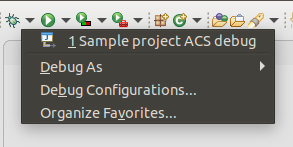
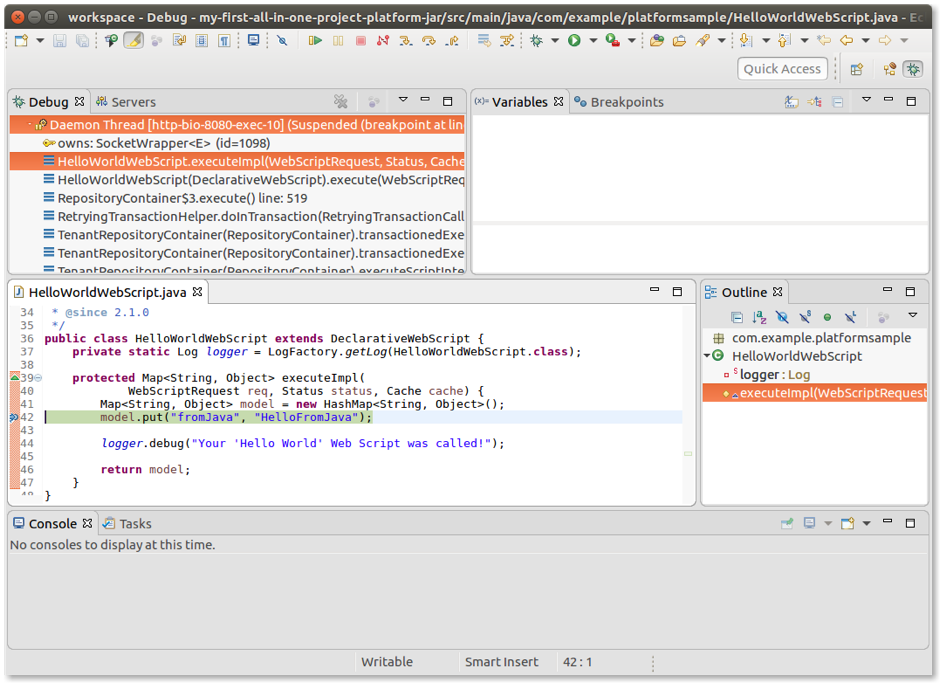

# Remote debugging using Eclipse

All the projects generated using the Alfresco SDK 4.x are pre-configured to listen for remote debug connections. Depending on the selected archetypes you'll 
have a port for remotely debugging ACS, share or both of them.

By default, the remote debug port for ACS is **8888** and for share is **9898**. This configuration can be changed through the maven properties `acs.debug.port` 
and `share.debug.port` in the `pom.xml` file of the main project.

```
    <!-- Environment configuration properties -->
    <share.port>8180</share.port>
    <share.debug.port>9898</share.debug.port>
    <acs.host>${artifactId}-acs</acs.host>
    <acs.port>8080</acs.port>
    <acs.debug.port>8888</acs.debug.port>
```

These remote debug ports are configured in the docker compose file to be exposed by the corresponding docker containers.

```
services:
  sample-project-share:
...
    environment:
      CATALINA_OPTS: "-agentlib:jdwp=transport=dt_socket,server=y,suspend=n,address=0.0.0.0:8888"
      REPO_HOST: sample-project-acs
      REPO_PORT: 8080
    ports:
      - "${share.port}:8080"
      - "${share.debug.port}:8888"
  sample-project-acs:
...
    environment:
      CATALINA_OPTS: "-agentlib:jdwp=transport=dt_socket,server=y,suspend=n,address=0.0.0.0:8888"
    ports:
      - "${acs.port}:8080"
      - "${acs.debug.port}:8888"
...
```

## Configuring remote debugging using Eclipse

Here you'll see how to create and manage a configuration to remotely debug your launched Alfresco project that's waiting for a connection. This assumes you 
have an Eclipse IDE up and running, and have already imported the same project you are going to debug.

For more details on how to import an Alfresco project into your Eclipse IDE, see Setting up your development environment using Eclipse.

1. Open the Eclipse IDE and click on `Run Configurations` (top right).


2. Click on the green plus sign (top left) and select `Remote Java Application` to add a new configuration for a remote app.

3. Enter a descriptive name for your configuration, for example, `Sample project ACS debug`.


4. Click Browse then locate the platform project JAR if you want to debug ACS or the share project JAR if you want to debug share.

5. Check that your settings match the screenshot. This is a sample to debug ACS. If you want to debug share or you have configured custom ports for remote 
debugging you'll need to modify that configuration. If you're working with _Docker Toolbox_ instead of _Docker Desktop_ the host to access the container won't
be `localhost` but a configured _IP_ address (i.e. 192.168.99.100).

6. Click `Apply`.

You will be taken back to the project source code.

7. Click on the bug icon and select the new configuration to run it.



The IDE connects the source code to the deployed one at the docker container. Once the code is linked, you can open a browser and start using your 
application. In our case, we are going to test the behaviour of debugging by running the sample webscript.

8. Open your browser and type `http://localhost:8080/alfresco/s/sample/helloworld`.

This is a sample webscript generated in every project created using SDK 4.x and the platform artifact.


Now let's find the `HelloWorldWebScript.java` file in the `src/main/java/.../platformsample` folder of your project. If you're using an All-In-One project, 
the folder is located in the platform sub-project.

9. Edit the file using Eclipse IDE and set a breakpoint (by clicking to the left of the line number) at line:

```
model.put(“fromJava”,”HelloFromJava”);
```

10. Refresh the browser. Eclipse will intercept the execution at the breakpoint:



From here the management is the same as for a regular Java application using your preferred IDE. Please note that the whole Alfresco source code is available 
at debug time, thanks to the local maven repository.
