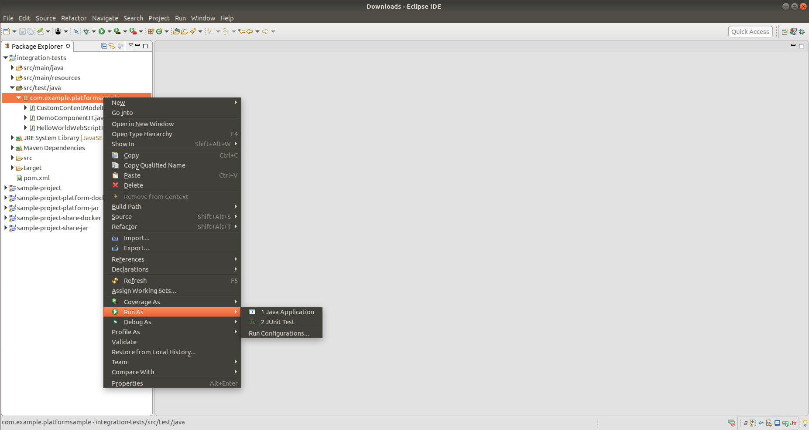
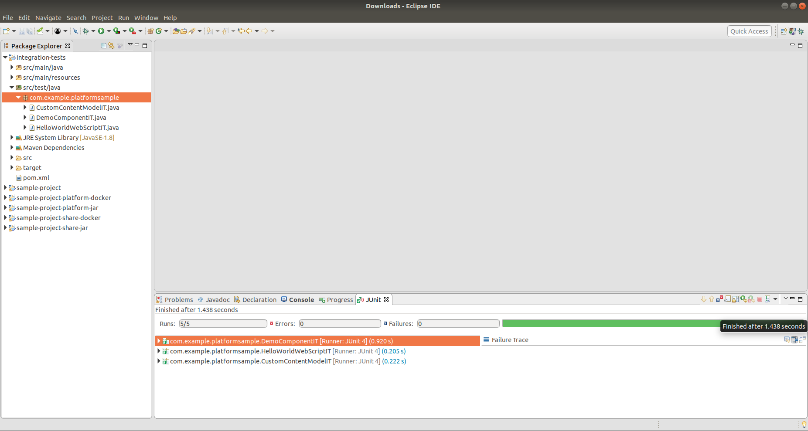
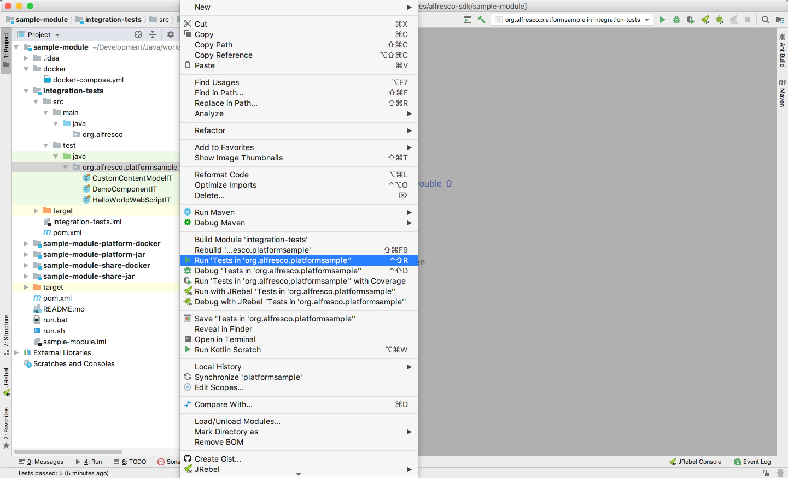
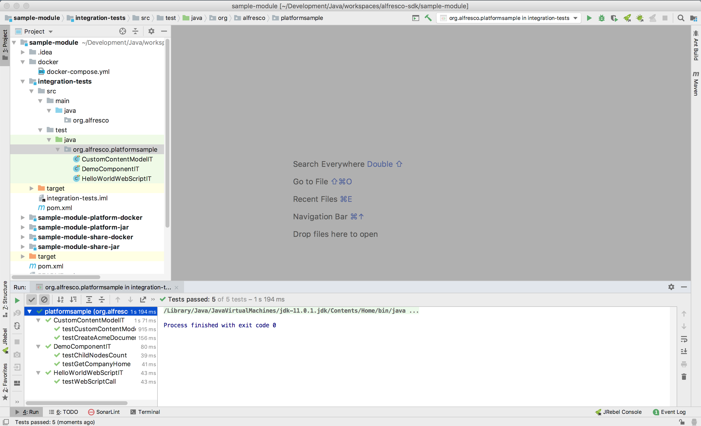

# How to run SDK's integration tests

Running the integration tests of a project generated from the Alfresco SDK 4.0 archetypes is pretty easy. Let's distinguish different cases of executing the
integration tests. 

## Command line

If you want to run the integration tests from the command line you'll have to use the utility scripts provided by all the projects generated from the 
archetypes. These are `run.sh` if you're on Unix systems or `run.bat` if you're on Windows systems.

If you want to spin up a new dockerised environment with ACS, run the integration tests and stop that environment, you'll use the `build_test` goal:

```
$ ./run.sh build_test
```

If you want all your previous data in the docker environment to be wiped out before the execution of the integration tests, remember to call the `purge` goal
before the `build_test` goal:

```
$ ./run.sh purge
$ ./run.sh build_test
```

The `build_test` goal will execute the next list of tasks: 
* Stop any previous execution of the dockerised environment.
* Compile all the source code.
* Rebuild the custom Docker images of the project.
* Start a new dockerised environment.
* Execute the integration tests.
* Show the logs of the docker containers during the tests execution.
* Stop the dockerised environment.

If your dockerised environment is already started and you simply want to execute the integration tests against that existing ACS instance, then use the `test`
goal:

```
$ ./run.sh test
```

### Configuring a custom ACS endpoint location

If you want to run your integration tests against an ACS instance not exposed in `http://localhost:8080/alfresco` you'll need to modify a maven property 
before executing the tests. 

The maven property for the test ACS instance endpoint location is `acs.endpoint.path` and you can configure it in the `pom.xml` file in the root folder of your 
project:

```
    <properties>
        ...
        <test.acs.endpoint.path>http://192.168.99.100:8080/alfresco</test.acs.endpoint.path>
        ..
    </properties>
```

This parameter is **specially important** if you're running your dockerised environment using [Docker Toolbox](https://docs.docker.com/toolbox/) instead of 
[Docker Desktop](https://www.docker.com/products/docker-desktop). If that is the case, then the Docker container exposed ports are not mapped in the hosted
machine as `localhost` but as an assigned IP address (i.e. `192.168.99.100`). 

## Eclipse IDE

If your project is available in Eclipse, you can easily run one or more of the integration tests directly from your IDE.

To run the integration tests:

1. In order to properly execute the integration tests the dockerised environment must be already up and running with IT support. So, before executing the tests 
you must run the `build_start_it_supported` or the `start` goal of the `run` script.

2. Open the project using the IDE.

3. Select the classes for the integration tests (either one, some, or the whole package).

4. Right click and select `Run As ...`, then click `JUnit Test`.



Once the tests have completed (typically, after a few seconds), the results are presented.



When using an IDE, the source code related to the integration tests is the one deployed directly on the platform side. This means that an update in the code 
for the Java classes will be included when you run the integration tests _if and only if_ they are deployed in the platform. To avoid stopping/starting 
Alfresco Content Services with every change, use **hot reloading** as the only way to deploy the new version of the Java classes. For more details, see 
[JRebel](../hot-reloading/jrebel.md) / [HotSwapAgent](../hot-reloading/hotswap-agent.md) Hot reloading.

## IntelliJ IDEA IDE

If your project is available in IntelliJ IDEA, you can easily run one or more of the integration tests directly from your IDE.

To run the integration tests:

1. In order to properly execute the integration tests the dockerised environment must be already up and running with IT support. So, before executing the tests 
you must run the `build_start_it_supported` or the `start` goal of the `run` script.

2. Open the project using the IDE.

3. Select the classes for the integration tests (either one, some, or the whole package).

4. Right click and select `Run Tests`.



Once the tests have completed (typically, after a few seconds), the results are presented.



When using an IDE, the source code related to the integration tests is the one deployed directly on the platform side. This means that an update in the code 
for the Java classes will be included when you run the integration tests _if and only if_ they are deployed in the platform. To avoid stopping/starting 
Alfresco Content Services with every change, use **hot reloading** as the only way to deploy the new version of the Java classes. For more details, see 
[JRebel](../hot-reloading/jrebel.md) / [HotSwapAgent](../hot-reloading/hotswap-agent.md) Hot reloading.
