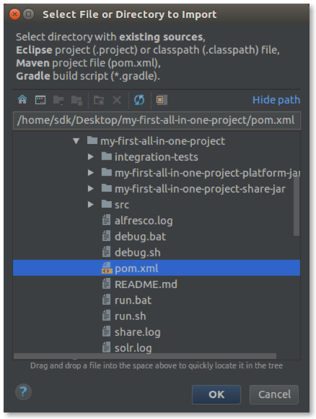
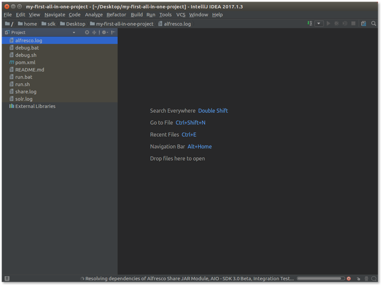

# Setting up your development environment using Intellij IDEA

The Maven Alfresco SDK is designed to work well with Eclipse. This support includes the ability to import existing Alfresco projects created using the 
Alfresco SDK.

Here we assume you already have an Eclipse installation up and running, together with an available Alfresco project created using the Alfresco SDK. If you 
don't have a project already, follow the steps in [Getting started with Alfresco SDK 4.x](../getting-started.md) to learn how to quickly generate it in a few 
easy steps.

## Importing the Alfresco project into Intellij IDEA

1. Starting from IntelliJ IDEA, select `File > Open` from the main menu to open the Alfresco project. Alternatively, select `Import Project` if you're running 
IntelliJ IDEA for the first time in your development environment.

2. After the project is imported, you will see a window similar to the following:

Once this is done, the project is successfully imported in IntelliJ IDEA. 

If you want more detail about how to work with the project, please visit [Working with generated projects](../working-with-generated-projects/README.md).
